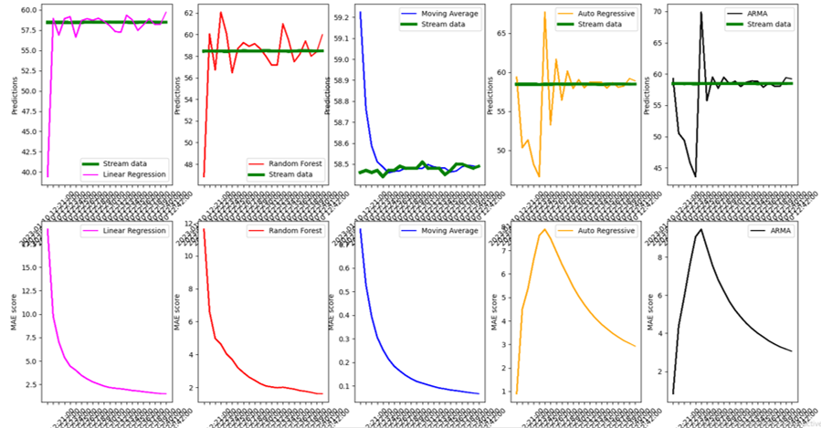

# Online Stock Prediction using Kafka (for streaming) and River (for learning)

The entry point of the project is the main.py file:

  1. After running the main file, you have to enter the company name you are interested in
  2. Then two processes are launched in parallel using ray decorator: 
        * The streaming of data from yahoofinance through stock_stream function in stock_stream.py file: The streamed data is ingested in the a kafka topic through a producer
        * The learning and the prediction of stock price using different models: linear, trees model, time series models (TrainModelOnline and TrainModelOffline classes)

While streaming data from yahoo finance using kafka and learning the stock price behaviour, a figure will be displayed that shows the predicted price at each timestamp

  

  
